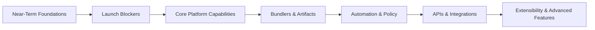

# Cloud Native Stack Roadmap

> This roadmap reflects current thinking and direction. It is not a commitment to specific delivery dates.  
> Priorities may evolve based on validation results, partner feedback, and community input.

**Announcement Goal**  
The initial public announcement target for the next generation of Cloud Native Stack is **KubeCon + CloudNativeCon Europe (March 2026)**. Near-term and launch-blocking items are prioritized to support this milestone.

**Table of Contents**
- [High-Level Roadmap](#high-level-roadmap)
- [Scope & Principles](#scope--principles)
- [Near-Term (Next Release)](#near-term-next-release)
- [Launch Blockers](#launch-blockers)
- [Backlog](#backlog)
- [Revision History](#revision-history)

## High-Level Roadmap



## Scope & Principles

**Project Scope**  
Cloud Native Stack generates validated configurations for GPU-accelerated Kubernetes deployments.  
Configurations are tested against NVIDIA GPU platforms (H100, GB200, A100, and others) and are intended to support both managed Kubernetes offerings (Amazon EKS, Google GKE, Azure AKS, Oracle OKE, etc.) and self-managed clusters.

The project focuses on:
- Capturing known-good configurations
- Making validation assumptions explicit
- Enabling reproducible deployment artifacts
- Integrating with existing infrastructure automation

It does not aim to replace Kubernetes distributions, provisioning systems, or managed services.

## Near-Term (Next Release)

### P0. Validate Current Bundlers

**Scope**  
Validate existing bundlers against known-good deployments to ensure they reliably reproduce validated configurations.

**Current Bundlers**
- Cert Manager
- GPU Operator
- Network Operator
- NVSentinel
- Skyhook

**Acceptance Criteria**
- [ ] All existing bundlers generate valid deployments from recipe measurements
- [ ] Generated artifacts reproduce known-good configurations
- [ ] Documentation clearly describes deployment steps and configuration options

## Launch Blockers

### P0. CNCF AI Conformance

**User Story**  
As a platform operator, I want to validate that my cluster meets CNCF AI conformance requirements so I can ensure compatibility with AI/ML workloads and demonstrate compliance to stakeholders.

**Scope**  
Integrate CNCF AI conformance testing into the CNS workflow, enabling both recipe validation (pre-deployment) and cluster validation (post-deployment).

**Acceptance Criteria**
- [ ] Recipe validation against CNCF AI conformance requirements
- [ ] Cluster validation via snapshot comparison to conformance baseline
- [ ] `cnsctl validate --conformance ai` command
- [ ] Conformance report generation (pass/fail with details)
- [ ] Integration with existing `validate` command workflow
- [ ] Documentation of conformance requirements and remediation steps

### P0. Recipe Generation from Cluster Measurements

**User Story**  
As a platform engineer, I want to generate a new recipe based on actual cluster measurements so that validated configurations can be captured, versioned, and shared across environments.

**Scope**  
Enable a workflow where cluster snapshots feed into recipe generation, with recipes published through the CNS repository and release process.

**Workflow**  
```
Cluster Snapshot → API Processing → CNS Repository PR → Review → Release
```

**Acceptance Criteria**
- [ ] API endpoint to submit cluster measurements for recipe generation
- [ ] Automatic recipe derivation from snapshot data
- [ ] PR generation to CNS repository with proposed recipe
- [ ] Review workflow for recipe validation before merge
- [ ] Versioned recipe release tied to CNS releases
- [ ] Provenance tracking (source cluster, snapshot timestamp, submitter)
- [ ] Documentation of contribution workflow

### P0. Recipe Performance Validation

**User Story**  
As a platform operator, I want to validate that a recipe produces expected performance characteristics so I can ensure deployments meet workload requirements before production rollout.

**Scope**  
Associate recipes with synthetic workloads and expected performance baselines, enabling automated validation of deployment quality.

**Acceptance Criteria**
- [ ] Synthetic workload definitions per recipe/platform combination
- [ ] Expected performance characteristics (throughput, latency, utilization)
- [ ] `cnsctl validate --performance` command
- [ ] Performance baseline comparison with tolerance thresholds
- [ ] Pass/fail reporting with metric details
- [ ] Support for GPU-specific benchmarks (NCCL, cuBLAS, inference latency)
- [ ] Integration with CI/CD for automated performance gates
- [ ] Documentation of benchmark methodology and baseline derivation

## Backlog

### Differential Snapshots & Drift Detection

**User Story**  
As a compliance or platform operator, I want to detect configuration drift between clusters to ensure consistency and catch unauthorized changes.

**Acceptance Criteria**
- [ ] `cnsctl diff baseline.yaml current.yaml` command
- [ ] Output formats:
  - [ ] Human-readable
  - [ ] JSON Patch (RFC 6902)
  - [ ] Tabular output
- [ ] Highlight critical differences:
  - [ ] GPU driver versions
  - [ ] Kubernetes versions
  - [ ] Security-relevant settings
- [ ] Exit codes:
  - [ ] `0 = identical`
  - [ ] `1 = drift detected`
- [ ] CI/CD integration examples
- [ ] Ignore rules for expected differences (timestamps, unique IDs)

### Core Platform Capabilities

#### Measurement Filtering

**User Story**  
As a developer, I want to capture only specific measurement types to reduce snapshot size and collection time.

**Acceptance Criteria**
- [ ] `cnsctl snapshot --filter gpu,os`
- [ ] `cnsctl snapshot --exclude k8s`
- [ ] Validation errors on unknown measurement types
- [ ] Excluded collectors are skipped entirely
- [ ] Documentation of common filter patterns

#### Configuration Files

**User Story**  
As a power user, I want persistent configuration so I do not need to repeat common flags on every command.

**Acceptance Criteria**
- [ ] Config file at `~/.config/cnsctl/config.yaml` (XDG-compliant)
- [ ] Defaults for common flags
- [ ] API server URL configuration
- [ ] CLI flags override config file values
- [ ] `cnsctl config init` command
- [ ] Validation on config load

#### Watch Mode

**User Story**  
As a monitoring system, I want continuous snapshot monitoring with change detection.

**Acceptance Criteria**
- [ ] `cnsctl snapshot --watch --interval 30s --on-change ./alert.sh`
- [ ] Stream JSON diffs to stdout
- [ ] Configurable polling interval
- [ ] Hook execution on change
- [ ] Graceful shutdown via signal handling

#### Platform-Specific Optimizations in Recipes

**User Story**  
As a GB200 or H100 operator, I want recipes to include platform-specific optimizations by default.

**Problem**  
Current recipes are largely generic and do not encode hardware-specific tuning.

**Approach**
- Introduce overlay-based recipe extensions
- Encode OS-level, kernel, and runtime tuning

**Acceptance Criteria**
- [ ] GB200 overlays (boot parameters, NUMA, IOMMU)
- [ ] H100-specific optimizations
- [ ] OS-level tuning via grub and sysctl
- [ ] Automatic application via generated bundles
- [ ] Documentation describing rationale and trade-offs

**Reference**
- `~archive/cns-v1/optimizations/GB200-NVL72.md`

#### Bundlers & Deployment Artifacts

#### Additional Bundlers

Planned bundlers include:

- **NIM Operator Bundler**  
  Support deployment and configuration of NVIDIA Inference Microservices.

- **Nsight Operator Bundler**  
  Enable cluster-wide profiling and observability tooling.

- **KServe Bundler**  
  Provide validated inference serving configurations.

- **Storage Bundler**  
  Encode best-practice storage configurations for GPU workloads.

- **Monitoring Bundler**  
  Integrate metrics, logging, and alerting components.

#### Multi-Bundler Orchestration

Support composing multiple bundlers into a single deployment plan, including:
- Dependency ordering
- Shared configuration inputs
- Coordinated rendering of artifacts

#### Bundle Distribution & Packaging

Explore mechanisms for:
- Versioned bundle packaging
- Distribution via OCI or artifact repositories
- Integrity and provenance metadata

### Automation, CI/CD & Policy

#### PVC-Based Agent Output

Enable Kubernetes agents to write snapshot output to PVCs for:
- Large snapshots
- Air-gapped environments
- Integration with offline pipelines

#### Policy Enforcement

Introduce policy evaluation for:
- Snapshot validation
- Recipe selection
- Bundle generation

Policies may gate deployments in CI/CD environments.

#### Cloud Storage Integration

Support snapshot upload to cloud storage backends for:
- Centralized analysis
- Historical comparison
- Cross-cluster auditing

### APIs & Interfaces

#### gRPC API Mode

Expose core CNS functionality via gRPC for programmatic integration.

#### GraphQL API

Enable flexible querying of configuration data and validation metadata.

#### Multi-Tenancy for API Server

Support isolation and access control for multiple users or organizations.

### Integrations (Cloud, Storage, Distribution)

#### Cloud Provider Integration

Align recipes and bundles with:
- AWS
- GCP
- Azure
- OCI

Including managed Kubernetes specifics and cloud-native primitives.

### Extensibility & Advanced Features

#### Plugin System

Allow external collectors, validators, or bundlers to be added without modifying core code.

#### Distributed Tracing

Add tracing to snapshot collection and bundle generation to improve observability and performance analysis.

### Design Opens & Architectural Questions

This section captures areas where design decisions are still open and community input is valuable.

### Architecture & Design
- Where should validation logic live?
- How tightly coupled should recipes and bundlers be?

### Storage & Distribution
- Best formats for long-term snapshot storage
- Artifact distribution models

### Bundle Generation & Orchestration
- Ordering guarantees
- Partial bundle updates

### Validation & Policy
- Policy languages and enforcement points

### Data Collection & Observability
- Telemetry volume vs signal
- Sampling strategies

### Performance & Scalability
- Large cluster behavior
- Snapshot size growth

### Developer Experience & Extensibility
- Plugin APIs
- Testing patterns

### Migration & Compatibility
- Backward compatibility guarantees
- Transition from earlier CNS versions

## Revision History
- **2026-01-01**: Initial comprehensive roadmap based on project objectives and gap analysis 
- **2026-01-05**: Added [Opens section](#opens) based on architectural decisions, implementation questions
- **2026-01-06**: Updated structure
