# Eidos Architecture

This directory contains architecture documentation for the Eidos (Eidos) tooling.

## First Principles

### Metadata Is Separate from How it is Consumed

* Validated configuration exists independent of how it is rendered, packaged, or deployed.  
* How users consume the artifacts we produce may vary; what is known to be correct does not.

**Why:** This prevents any tight coupling of correctness to a specific tool, workflow, or delivery mechanism.

### Correctness Must Be Reproducible

* Given the same inputs, the same system version must always produce the same result.  
* Reproducibility is a key prerequisite for debugging, validation, and trust.

**Why:** This rules out hidden state, implicit defaults, and non-deterministic behavior.

### Recipe Specialization Requires Explicit Intent

* More specific recipes must never be matched unless explicitly requested.  
* Generic intent cannot silently resolve to specialized configurations.

**Why:** This prevents accidental misconfiguration and preserves user control.

### Trust Requires Verifiable Provenance

* Trust is established through evidence, not assertions.  
* Every released artifact must carry verifiable and non-falsifiable proof of where it came from and how it was produced.

**Why:** This principle underpins supply-chain security, compliance, and confidence.

### Adoption Comes from Value and Idiomatic Experience

* The system must integrate into how users already work.  
* The system provides validated configuration, not a new operational model.

**Why:** If adoption requires retraining users on “the right way” then our design has failed.


## Components

- **[CLI Architecture](cli.md)**: Command-line tool (`eidos`) implementing all four workflow stages
  - Commands: `snapshot`, `recipe`, `validate`, `bundle`
  - Recipe generation modes: Query mode (direct parameters) and snapshot mode (analyze captured state)
  - Validation: Check recipe constraints against cluster snapshots
  - ConfigMap integration: Read and write operations using `cm://namespace/name` URI format
  - Testing: `tools/e2e` script validates complete workflow
- **[API Server Architecture](api-server.md)**: HTTP REST API for recipe generation and bundle creation
  - Endpoints: `GET /v1/recipe` (query mode only), `POST /v1/bundle` (bundle generation)
  - Does not support snapshot capture or validation (use CLI or agent)
- **Bundler Framework**: Extensible system for generating deployment artifacts
  - Execution model: Multiple bundlers run concurrently by default
  - Registration: Bundlers self-register via `init()` function
  - Current bundlers: GPU Operator, Network Operator, Skyhook, Cert-Manager, NVSentinel, DRA Driver
  - Value overrides: CLI `--set` flag allows runtime customization of bundle values
  - Node scheduling: `--system-node-selector`, `--accelerated-node-selector`, `--*-toleration` flags for workload placement
- **Deployer Framework**: GitOps integration for deployment artifacts
  - Deployment methods: `helm` (default), `argocd`
  - Deployment ordering: Respects `deploymentOrder` from recipe for correct component installation sequence
  - Helm: Generates Helm umbrella chart with dependencies
  - ArgoCD: Uses `sync-wave` annotations for ordered deployment

## Overview

Eidos provides a four-step workflow for optimizing GPU infrastructure deployments:

```
┌──────────────┐      ┌──────────────┐      ┌──────────────┐      ┌──────────────┐
│   Snapshot   │─────▶│    Recipe    │─────▶│   Validate   │─────▶│    Bundle    │
└──────────────┘      └──────────────┘      └──────────────┘      └──────────────┘
Capture system        Generate optimized    Check cluster         Create deployment
configuration         recommendations       compatibility         artifacts
```

### Step 1: Snapshot – Capture System Configuration
Captures comprehensive system state including OS, kernel, GPU, Kubernetes, and SystemD configurations.
- **CLI**: `eidos snapshot` command
- **Agent**: Kubernetes Job for automated cluster snapshots (writes to ConfigMap)
- **Output**: YAML/JSON snapshot with all system measurements
- **Storage**: File, stdout, or **Kubernetes ConfigMap** (`cm://namespace/name` URI)

### Step 2: Recipe – Generate Configuration Recommendations
Produces optimized configuration recipes based on environment criteria or captured snapshots.
- **CLI**: `eidos recipe` command (supports query mode and snapshot mode)
  - **Query Mode**: Direct recipe generation from criteria (service, accelerator, intent, OS, nodes)
  - **Snapshot Mode**: Analyzes captured snapshots and generates tailored recipes based on workload intent
  - **ConfigMap Input**: Can read snapshots from ConfigMap URIs (`cm://namespace/name`)
- **API Server**: `GET /v1/recipe` endpoint for programmatic access (query mode only)
- **Multi-Level Inheritance**: Recipes support `spec.base` references for inheritance chains
  - Example chain: `base → eks → eks-training → gb200-eks-training → gb200-eks-ubuntu-training`
  - Intermediate recipes (eks, eks-training, gb200-eks-training) capture shared configurations
  - Leaf recipes (gb200-eks-ubuntu-training) contain hardware + OS-specific overrides
- **Output**: Recipe with component references and deployment constraints
- **Storage**: File, stdout, or **Kubernetes ConfigMap**

### Step 3: Validate – Check Cluster Compatibility
Validates recipe constraints against actual system measurements from a snapshot.
- **CLI**: `eidos validate` command
- **Input Sources**: File paths, HTTP/HTTPS URLs, or ConfigMap URIs for both recipe and snapshot
- **Constraint Format**: Fully qualified paths (`K8s.server.version`, `OS.release.ID`)
- **Operators**: Version comparisons (`>=`, `<=`, `>`, `<`), equality (`==`, `!=`), exact match
- **Output**: Validation result with passed/failed/skipped constraints
- **CI/CD Integration**: `--fail-on-error` flag for non-zero exit on failures

### Step 4: Bundle – Create Deployment Artifacts
Generates deployment-ready bundles (Helm values, Kubernetes manifests, installation scripts) from recipes.
- **CLI**: `eidos bundle` command
- **API Server**: `POST /v1/bundle` endpoint (returns zip archive)
- **ConfigMap Input**: Can read recipes from ConfigMap URIs (CLI only)
- **Parallel execution** of multiple bundlers by default
- **Available bundlers**: GPU Operator, Network Operator, Skyhook, Cert-Manager, NVSentinel, DRA Driver
- **Deployment methods** (`--deployer` flag):
  - `helm` (default): Helm umbrella chart with dependencies
  - `argocd`: ArgoCD Application manifests with sync-wave ordering (use `--repo` to set Git repository URL)
- **Deployment ordering**: Components deployed in sequence defined by recipe's `deploymentOrder` field
- **Value Overrides**: Use `--set bundler:path.to.field=value` to customize generated bundles (CLI only)
- **Node Scheduling**: Use `--system-node-selector`, `--accelerated-node-selector`, and toleration flags for workload placement (CLI only)
- **Git Repository URL**: Use `--repo` to set the Git repository URL in ArgoCD `app-of-apps.yaml` (avoids placeholder)
- **Output**: Complete deployment bundle with values, manifests, scripts, and checksums

**Note:** The API Server supports recipe generation (Step 2) and bundle creation (Step 3). For snapshot capture, use the CLI.

## Key Design Principles

### 1. Separation of Concerns
**Pattern**: Shared library with multiple entry points (CLI, API server)  
**Rationale**: Maximizes code reuse while maintaining deployment flexibility  
**Reference**: [Go Project Layout](https://go.dev/doc/modules/layout)

**Critical Sub-Principle: UI vs Functional Packages**

User interaction packages (`pkg/cli`, `pkg/api`) and functional packages (`pkg/oci`, `pkg/bundler`, `pkg/recipe`, `pkg/collector`) have distinct responsibilities:

| Package Type | Responsibility | Examples |
|--------------|----------------|----------|
| **User Interaction** | Capture user intent, validate input, format output | `pkg/cli` (CLI flags/output), `pkg/api` (HTTP handlers) |
| **Functional** | Self-contained business logic, reusable across entry points | `pkg/oci` (OCI packaging), `pkg/bundler` (artifact generation) |

**Rules:**
1. User interaction packages should **never** contain business logic
2. Functional packages should be **usable independently** without CLI/API
3. Functional packages return **structured data** (not formatted strings)
4. User interaction packages **format and present** structured data from functional packages

**Example - OCI Workflow:**
```go
// pkg/oci/reference.go - Functional package
type Reference struct { ... }
func ParseOutputTarget(target string) (*Reference, error) { ... }
func PackageAndPush(ctx, cfg) (*PackageAndPushResult, error) { ... }

// pkg/cli/bundle.go - User interaction package
ref, err := oci.ParseOutputTarget(output)  // Capture intent
result, err := oci.PackageAndPush(ctx, cfg) // Delegate to functional package
fmt.Printf("Pushed to %s\n", result.Digest) // Format output
```

**Example - Deployment Instructions:**
```go
// pkg/bundler/deployer/helm/helm.go - Returns structured data
out.DeploymentSteps = []string{"helm install...", "kubectl get pods..."}

// pkg/cli/bundle.go - Formats for display
for _, step := range out.Deployment.Steps {
    fmt.Println(step)
}
```

### 2. Concurrent Collection with Bounded Parallelism
**Pattern**: `errgroup.WithContext` for fail-fast concurrent operations  
**Rationale**: Parallel collection reduces latency; context propagation enables cancellation  
**Trade-offs**: Memory overhead vs latency gain; appropriate for I/O-bound operations  
**Reference**: [golang.org/x/sync/errgroup](https://pkg.go.dev/golang.org/x/sync/errgroup)

**Implementation**:
```go
g, ctx := errgroup.WithContext(parentCtx)
g.Go(func() error { return collectK8s(ctx) })
g.Go(func() error { return collectGPU(ctx) })
if err := g.Wait(); err != nil {
    // First error cancels all goroutines via context
    return fmt.Errorf("collection failed: %w", err)
}
```

### 3. Pluggable Collectors via Abstract Factory
**Pattern**: Factory interface with concrete implementations  
**Rationale**: Testability (mock collectors), extensibility (add new sources)  
**Trade-off**: Additional abstraction vs testing simplicity  
**Reference**: [Go Interfaces](https://go.dev/doc/effective_go#interfaces)

### 4. Format Flexibility through Strategy Pattern
**Pattern**: Serializer interface with format-specific implementations  
**Rationale**: Open/closed principle - add formats without modifying callers  
**Implementation**: JSON, YAML, Table writers behind common `Serialize` interface

### 5. Production-Ready HTTP Server
**Patterns Implemented**:
- **Rate Limiting**: Token bucket (`golang.org/x/time/rate`)  
- **Graceful Shutdown**: Signal handling with deadline-based cleanup  
- **Observability**: Prometheus metrics, structured logging (three modes: CLI/Text/JSON), request tracing  
- **Resilience**: Panic recovery, timeout enforcement, circuit breaker patterns  

**References**:  
- [Graceful Shutdown](https://pkg.go.dev/net/http#Server.Shutdown)  
- [Rate Limiting](https://pkg.go.dev/golang.org/x/time/rate)  
- [Prometheus Best Practices](https://prometheus.io/docs/practices/naming/)

### 6. Semantic Versioning with Precision Control
**Pattern**: Version struct with Major.Minor.Patch components  
**Rationale**: Flexible matching (1.2 matches 1.2.x); reject negative components  
**Trade-off**: Complexity vs matching flexibility  
**Reference**: [Semantic Versioning 2.0.0](https://semver.org/)

### 7. Immutable Data Structures
**Pattern**: Read-only recipe store with deep cloning for modifications  
**Rationale**: Thread-safety without locks; functional programming style  
**Implementation**: `sync.Once` for initialization, cloning for per-request mutations

### 8. Context-Aware Request Handling
**Pattern**: Context propagation for cancellation and timeouts  
**Rationale**: Prevents resource leaks; enables graceful degradation  
**Reference**: [Go Context Package](https://pkg.go.dev/context)

### 9. Kubernetes Client Singleton
**Pattern**: Cached Kubernetes client with `sync.Once` initialization  
**Location**: `pkg/k8s/client` package  
**Rationale**: Prevents connection exhaustion and reduces load on Kubernetes API server  
**Trade-offs**: Single client instance vs flexibility; appropriate for read-heavy workloads  
**Reference**: [Go sync.Once](https://pkg.go.dev/sync#Once)

**Implementation**:
```go
import "github.com/NVIDIA/eidos/pkg/k8s/client"

// First call creates client; subsequent calls return cached instance
clientset, config, err := client.GetKubeClient()
```

**Authentication Modes**:
- **In-cluster**: Uses service account credentials automatically
- **Out-of-cluster**: Loads from `KUBECONFIG` environment variable or `~/.kube/config`

**Usage in Collectors**: The K8s collector and ConfigMap serializer both use this singleton to ensure efficient connection reuse across all Kubernetes API operations.

## Deployment Topologies

### Topology 1: Standalone CLI
**Use Case**: Local development, CI/CD pipelines, troubleshooting  
**Architecture**: Single binary, no network dependencies  
**Scaling**: Run on each node/machine independently

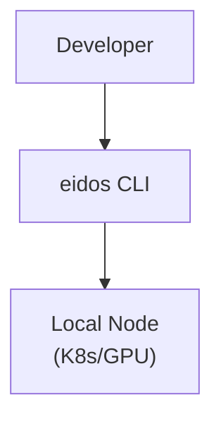

### Topology 2: Centralized API with Load Balancer
**Use Case**: Production environments, multi-tenant platforms  
**Architecture**: Multiple stateless replicas behind L7 load balancer  
**Scaling**: Horizontal auto-scaling based on request rate/latency

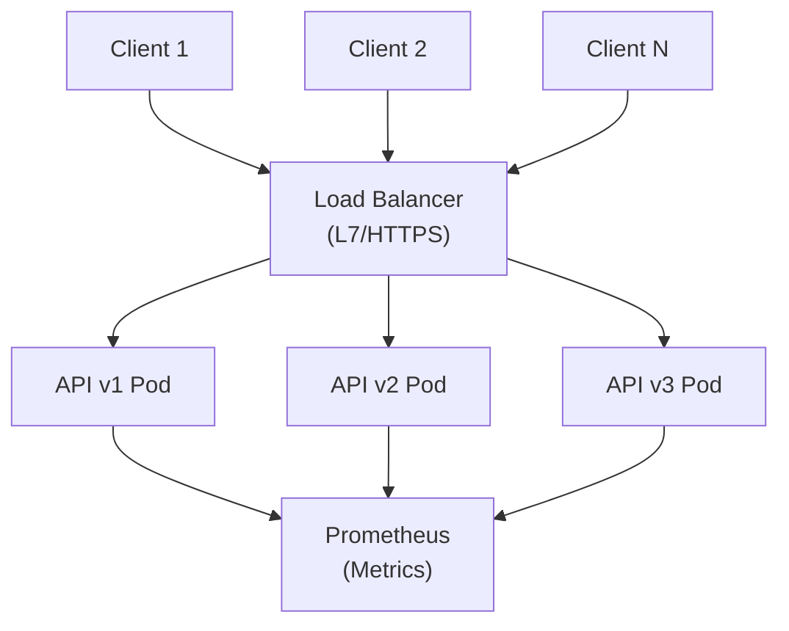

### Topology 3: Kubernetes Job Agent
**Use Case**: Automated cluster auditing, scheduled configuration checks  
**Architecture**: Job running on GPU nodes with ConfigMap output (no volumes needed)  
**Scaling**: One Job per node or node-group  
**Features**: RBAC-secured, ConfigMap-native storage, no file dependencies

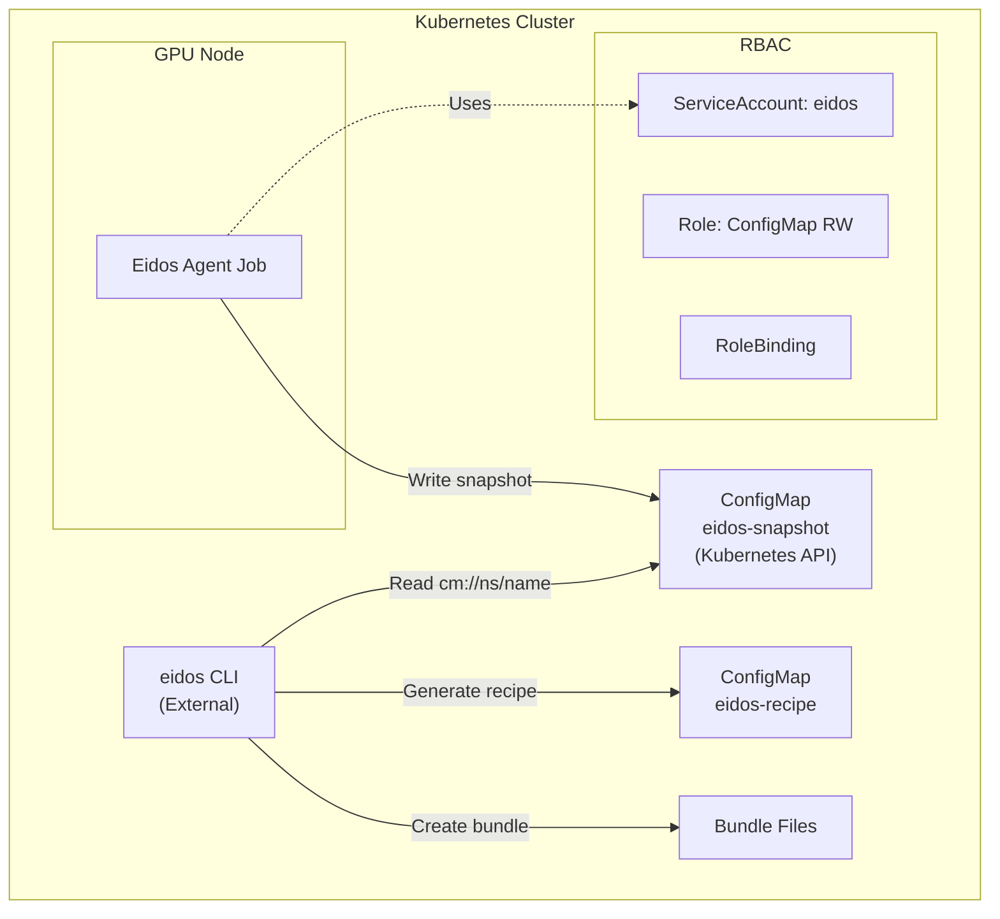

### Topology 4: Service Mesh Integration
**Use Case**: Zero-trust environments, mTLS everywhere  
**Architecture**: API server with sidecar proxy (Istio, Linkerd)  
**Scaling**: Service mesh handles load balancing, circuit breaking, retries

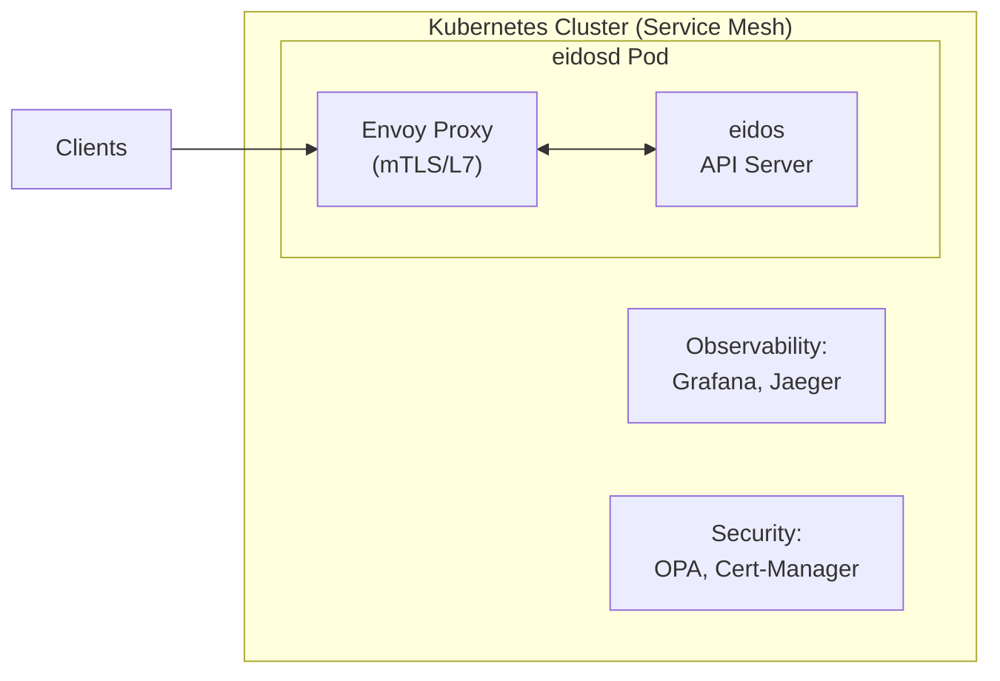

## Shared Core Packages

Both components leverage shared functionality:

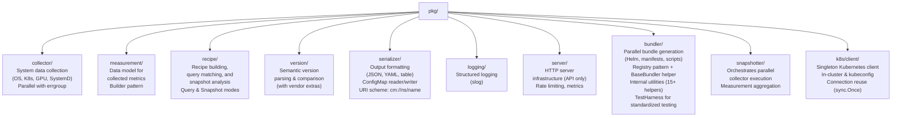

## Data Flow

### Complete Four-Step Workflow (File-based)
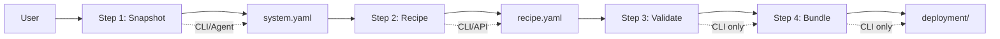

### Complete Four-Step Workflow (ConfigMap-based)
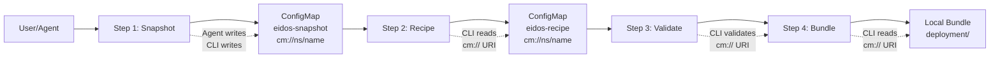

### CLI Snapshot Flow (Step 1)
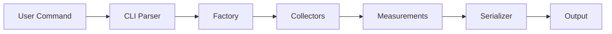

### CLI Recipe Flow (Step 2)
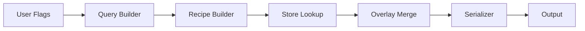

### API Recipe Flow (Step 2 - Programmatic)


### CLI Bundle Flow (Step 3)
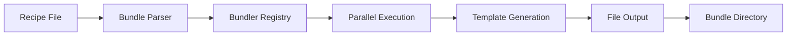

## Failure Modes and Recovery Strategies

### Collector Failures
**Failure**: Individual collector (K8s, GPU, SystemD) fails  
**Detection**: `errgroup` propagates first error  
**Recovery**: 
- **Fail-fast** (current): Entire snapshot fails if any collector fails  
- **Best-effort** (alternative): Continue with partial data, mark incomplete

**Trade-off Analysis**:  
- Fail-fast ensures data consistency but may be too strict  
- Best-effort improves availability but complicates downstream logic  
- **Decision**: Fail-fast for now; add best-effort mode behind feature flag

### Kubernetes API Server Unavailable
**Failure**: K8s API server unreachable or rate-limiting  
**Detection**: HTTP errors, context deadline exceeded  
**Recovery**:  
- Exponential backoff with jitter (2^n * 100ms + rand(0, 100ms))  
- Max retries: 3 with circuit breaker after 5 consecutive failures  
- Fallback: Cached data (if stale data acceptable)  

**Implementation Guidance**:  
```go
import "k8s.io/client-go/util/retry"

retry.OnError(retry.DefaultBackoff, func(err error) bool {
    return errors.Is(err, context.DeadlineExceeded)
}, func() error {
    return client.Get(ctx, key, obj)
})
```

**Reference**: [client-go Retry](https://pkg.go.dev/k8s.io/client-go/util/retry)

### GPU Driver/SMI Unavailable
**Failure**: nvidia-smi not found, driver not loaded  
**Detection**: Exec error, exit code != 0  
**Recovery**:  
- Graceful degradation: Return empty GPU measurements  
- Log warning with actionable message  
- Continue with other collectors

### ConfigMap Write Failure (Agent)
**Failure**: Kubernetes API unavailable, RBAC permissions insufficient  
**Detection**: HTTP 403 Forbidden, 500 Internal Server Error  
**Recovery**:  
- Retry with exponential backoff (3 attempts)  
- Verify RBAC RoleBinding references correct namespace  
- Fallback to stdout output (manual collection)  
- Log detailed error with kubeconfig context

**Common Causes**:  
- RoleBinding namespace mismatch (should be `gpu-operator`)
- ServiceAccount not created or not mounted
- NetworkPolicy blocking Kubernetes API access
- API server rate limiting

**Troubleshooting**:
```bash
# Verify RBAC configuration
kubectl get role,rolebinding -n gpu-operator
kubectl auth can-i create configmaps --as=system:serviceaccount:gpu-operator:eidos -n gpu-operator

# Check agent logs
kubectl logs job/eidos -n gpu-operator
```

### Rate Limit Exceeded (API Server)
**Failure**: HTTP 429 Too Many Requests  
**Detection**: Response status code  
**Recovery**:  
- Read `Retry-After` header  
- Adaptive rate limiting: Reduce request rate dynamically  
- Circuit breaker: Open after N consecutive 429s  

**Implementation Pattern**:  
```go
if resp.StatusCode == http.StatusTooManyRequests {
    retryAfter := parseRetryAfter(resp.Header.Get("Retry-After"))
    select {
    case <-time.After(retryAfter):
        return retry()
    case <-ctx.Done():
        return ctx.Err()
    }
}
```

### Memory Exhaustion
**Failure**: Large cluster with 1000s of pods causing OOM  
**Detection**: Runtime memory stats, container limits  
**Prevention**:  
- Streaming JSON parsing for large responses  
- Pagination for list operations  
- Memory limits in Kubernetes Deployment  

**Monitoring**:  
```promql
process_resident_memory_bytes / container_spec_memory_limit_bytes > 0.9
```

### API Server Graceful Shutdown
**Scenario**: SIGTERM received during active requests  
**Behavior**:  
1. Stop accepting new connections  
2. Wait for in-flight requests (30s timeout)  
3. Force-close remaining connections  
4. Exit with code 0

**Implementation** (already in place):  
```go
ctx, stop := signal.NotifyContext(context.Background(), 
    os.Interrupt, syscall.SIGTERM)
defer stop()

g.Go(func() error {
    <-ctx.Done()
    shutdownCtx, cancel := context.WithTimeout(
        context.Background(), 30*time.Second)
    defer cancel()
    return server.Shutdown(shutdownCtx)
})
```

**Reference**: [Graceful Shutdown](https://pkg.go.dev/net/http#Server.Shutdown)

## Performance Considerations

### Latency Budget Breakdown

**Target**: p99 < 100ms for snapshot operations

| Component | Latency | Mitigation |
|-----------|---------|------------|
| K8s API List Pods | 10-50ms | Pagination, field selectors |
| SystemD DBus Calls | 5-20ms | Parallel collection |
| GPU nvidia-smi | 10-30ms | Cache results (5s TTL) |
| GRUB/Sysctl Read | 1-5ms | Buffered I/O |
| JSON Serialization | 1-10ms | Streaming encoder |
| **Total (parallel)** | **50-100ms** | **errgroup parallelism** |

### Memory Profile

| Component | Memory | Optimization |
|-----------|--------|-------------|
| Recipe Store | 5-10MB | Embed compressed YAML |
| K8s Client | 10-20MB | Shared informers |
| Snapshot Data | 1-5MB | Streaming serialization |
| Go Runtime | 5-10MB | GOGC tuning |
| **Total** | **21-45MB** | **Minimal footprint** |

### Concurrency Patterns

**CLI**: Bounded parallelism with errgroup (1 goroutine per collector)
```go
g, ctx := errgroup.WithContext(ctx)
g.SetLimit(5) // Max 5 concurrent collectors
```

**API Server**: Per-request goroutines (bounded by rate limiter)  
- Rate limiter prevents goroutine explosion  
- Each request handled in dedicated goroutine (Go's http.Server pattern)  
- No explicit goroutine pooling needed

**Reference**: [Go HTTP Server Concurrency](https://go.dev/blog/context)

## Security Architecture

### Threat Model

| Threat | Impact | Mitigation | Priority |
|--------|--------|------------|----------|
| **DoS via Rate Exhaustion** | High | Token bucket rate limiter | P0 |
| **Memory Exhaustion** | High | Request timeouts, memory limits | P0 |
| **Command Injection** | Critical | No shell exec; use syscall | P0 |
| **Path Traversal** | Medium | Validate file paths | P1 |
| **Information Disclosure** | Medium | Sanitize error messages | P1 |
| **MITM** | High | TLS enforcement (external proxy) | P1 |
| **Replay Attacks** | Low | Idempotent operations | P2 |

### Defense in Depth

**Layer 1: Network**  
- Kubernetes NetworkPolicy: Restrict ingress to API server  
- Service Mesh mTLS: Encrypt inter-service communication

**Layer 2: Application**  
- Input validation: Strict enum/version parsing  
- Rate limiting: Prevent resource exhaustion  
- Timeout enforcement: Kill long-running requests

**Layer 3: Runtime**  
- Least privilege: Run as non-root user (UID 1000)  
- Read-only root filesystem  
- Seccomp/AppArmor profiles

**Layer 4: Data**  
- No sensitive data in logs  
- Sanitize error messages (no stack traces to clients)

### Secure Defaults

```yaml
securityContext:
  runAsNonRoot: true
  runAsUser: 1000
  readOnlyRootFilesystem: true
  allowPrivilegeEscalation: false
  capabilities:
    drop: ["ALL"]
  seccompProfile:
    type: RuntimeDefault
```

## Observability Strategy

### Three Pillars

**1. Metrics** (Prometheus)  
- **RED Method**: Rate, Errors, Duration per endpoint  
- **USE Method**: Utilization, Saturation, Errors for resources  
- **Custom**: Recipe cache hit rate, collector success rate

**2. Logs** (Three modes via slog)  
- **CLI Mode** (default): Minimal user-friendly output, red ANSI color for errors
- **Text Mode** (--debug): Key=value format with full metadata
- **JSON Mode** (--log-json): Structured JSON for machine parsing
- **Levels**: DEBUG, INFO, WARN, ERROR  
- **Context**: Request ID, user ID, trace ID  
- **Sampling**: 1/100 for DEBUG in production

**3. Traces** (OpenTelemetry - future)  
- **Spans**: HTTP request → Collectors → Serialization  
- **Baggage**: Request metadata propagation  
- **Sampling**: Probability-based (10% of requests)

### SLIs and SLOs

| SLI | SLO | Alert Threshold |
|-----|-----|----------------|
| Availability | 99.9% | < 99.5% over 5m |
| Latency (p99) | < 100ms | > 200ms over 5m |
| Error Rate | < 0.1% | > 1% over 5m |
| Rate Limit Rejects | < 5% | > 10% over 5m |

**Error Budget**: 43 minutes downtime per month (99.9% SLO)

## Bundler Framework Architecture

### Overview

The Bundler Framework provides an extensible system for generating deployment bundles from configuration recipes. It uses a **generic bundler framework** with `ComponentConfig` struct and `MakeBundle()` function that handles all common bundling logic. This enables rapid bundler development where most components can be implemented in ~50 lines.

### Design Principles

**1. Declarative Component Registry**
**Rationale**: No Go code required for new components; configuration in YAML
**Implementation**: Components defined in `pkg/recipe/data/registry.yaml`; bundler loads configuration automatically
**Benefits**: Zero boilerplate; consistent configuration; easy to add new components
**Components**: `recipe.ComponentRegistry`, `recipe.ComponentConfig`, `component.BaseBundler`

**2. Registry-Based Configuration**
**Pattern**: Define component behavior via YAML configuration in registry.yaml
**Rationale**: Readable, testable, maintainable; no Go code for new components
**Implementation**: Required fields (name, displayName) plus optional extensions (helm, nodeScheduling)
**Extensions**: Custom manifest files in `components/<name>/manifests/` for additional K8s resources

**3. BaseBundler Helper Pattern**
**Rationale**: Common file operations across all bundlers
**Implementation**: Struct embedding with methods (directory creation, file writing, template rendering, checksum generation)
**Reference**: [pkg/component](../../pkg/component)

**4. Registry Pattern**  
**Rationale**: Decoupled bundler registration; extensibility without modifying core code  
**Implementation**: Thread-safe global registry with `MustRegister()` (panics on duplicates)  
**Trade-off**: Runtime registration vs compile-time safety; fail-fast on conflicts

**5. Functional Options**  
**Pattern**: Configuration via variadic option functions  
**Rationale**: Optional parameters without constructor bloat; backward compatibility  
**Reference**: [Self-referential functions and the design of options](https://commandcenter.blogspot.com/2014/01/self-referential-functions-and-design.html)

**6. Direct Struct-to-Template Pattern**  
**Pattern**: Pass typed Go structs or maps directly to text/template  
**Rationale**: Type safety (for structs), simplicity, eliminates data conversion layer  
**Implementation**: Values maps or BundleMetadata structs render directly in templates  
**Reference**: [text/template](https://pkg.go.dev/text/template)

**7. Parallel Execution by Default**  
**Pattern**: errgroup.WithContext for concurrent bundle generation  
**Rationale**: Fast bundle creation; configurable fail-fast behavior  
**Implementation**: All bundlers execute in parallel automatically when no bundler types specified  
**Trade-off**: Memory usage vs latency; coordination overhead vs throughput

### Component Architecture

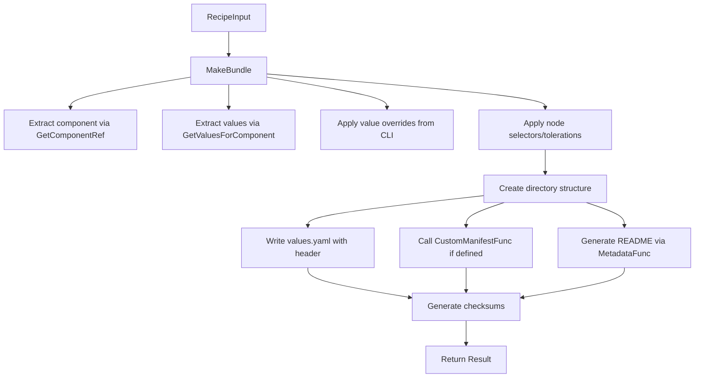

### Bundler Interface

```go
// Bundler generates deployment bundles from RecipeInput.
type Bundler interface {
    // Make generates a bundle in the specified directory.
    Make(ctx context.Context, input recipe.RecipeInput, dir string) (*result.Result, error)
}

// BaseBundler provides common bundler functionality.
// Embed this in your bundler implementation.
type BaseBundler struct {
    Config *config.Config
    Result *result.Result
}

// BaseBundler methods (available to embedders):
// - CreateBundleDir(outputDir, bundleName) (BundleDirectories, error)
// - WriteFile(path string, data []byte, perm os.FileMode) error
// - GenerateFileFromTemplate(ctx, getter, name, path, data, perm) error
// - GenerateChecksums(ctx, dir) error
// - Finalize(start time.Time)
// - BuildConfigMapFromInput(input) map[string]string
```

### ComponentConfig Pattern

The generic bundler framework uses `ComponentConfig` to define component-specific settings declaratively:

```go
// ComponentConfig defines all component-specific settings for a bundler.
type ComponentConfig struct {
    // Required fields
    Name                  string                  // Component name (matches recipe)
    DisplayName           string                  // Human-readable name for headers
    ValueOverrideKeys     []string                // CLI --set prefix keys
    DefaultHelmRepository string                  // Default Helm repo URL
    DefaultHelmChart      string                  // Default Helm chart name
    TemplateGetter        func(string) (string, bool)  // Template access function
    
    // Optional: Node scheduling paths
    SystemNodeSelectorPaths      []string        // Paths for system node selectors
    SystemTolerationPaths        []string        // Paths for system tolerations
    AcceleratedNodeSelectorPaths []string        // Paths for GPU node selectors
    AcceleratedTolerationPaths   []string        // Paths for GPU tolerations
    
    // Optional: Custom extensions
    MetadataFunc       MetadataFunc       // Custom metadata for README templates
    CustomManifestFunc CustomManifestFunc // Additional K8s manifest generation
}
```

### GPU Operator Configuration (Example)

**Implementation**: Declarative configuration in `pkg/recipe/data/registry.yaml`
**Code Size**: Zero Go code required
**Output**: Helm umbrella chart with GPU Operator as dependency

**Registry Configuration** (`pkg/recipe/data/registry.yaml`):
```yaml
- name: gpu-operator
  displayName: GPU Operator
  valueOverrideKeys:
    - gpuoperator
  helm:
    defaultRepository: https://helm.ngc.nvidia.com/nvidia
    defaultChart: nvidia/gpu-operator
    defaultVersion: v25.3.3
  nodeScheduling:
    system:
      nodeSelectorPaths:
        - operator.nodeSelector
        - node-feature-discovery.gc.nodeSelector
        - node-feature-discovery.master.nodeSelector
      tolerationPaths:
        - operator.tolerations
    accelerated:
      nodeSelectorPaths:
        - daemonsets.nodeSelector
        - node-feature-discovery.worker.nodeSelector
      tolerationPaths:
        - daemonsets.tolerations
```

**Bundle Contents** (Helm umbrella chart):
```
bundle/
├── Chart.yaml               # Umbrella chart with dependencies
├── values.yaml              # Combined values for all components
├── README.md                # Deployment instructions
├── recipe.yaml              # Copy of input recipe
├── templates/               # Custom manifests (if any)
│   └── dcgm-exporter.yaml   # DCGM metrics ConfigMap
└── checksums.txt            # SHA256 checksums
```

### Example: Adding a New Component

Adding a new component requires only YAML configuration:

**Step 1: Add to registry** (`pkg/recipe/data/registry.yaml`):
```yaml
- name: my-operator
  displayName: My Operator
  valueOverrideKeys:
    - myoperator
  helm:
    defaultRepository: https://charts.example.com
    defaultChart: example/my-operator
    defaultVersion: v1.0.0
  nodeScheduling:
    system:
      nodeSelectorPaths:
        - operator.nodeSelector
```

**Step 2: Create values file** (`pkg/recipe/data/components/my-operator/values.yaml`):
```yaml
operator:
  replicas: 1
  image:
    repository: example/my-operator
    tag: v1.0.0
```

**Step 3: Reference in recipe overlay** (`pkg/recipe/data/overlays/my-recipe.yaml`):
```yaml
componentRefs:
  - name: my-operator
    type: Helm
    version: v1.0.0
    source: https://charts.example.com
    valuesFile: components/my-operator/values.yaml
```

No Go code is required. The bundler automatically loads the component configuration from the registry.

### Usage Example

```go
package main

import (
    "context"
    "fmt"
    "github.com/NVIDIA/eidos/pkg/bundler"
    "github.com/NVIDIA/eidos/pkg/recipe"
)

func main() {
    ctx := context.Background()

    // Load recipe result
    recipeResult, err := recipe.LoadFromFile("recipe.yaml")
    if err != nil {
        panic(err)
    }

    // Create bundler
    b, err := bundler.New()
    if err != nil {
        panic(err)
    }

    // Generate umbrella chart
    output, err := b.Make(ctx, recipeResult, "./output")
    if err != nil {
        panic(err)
    }

    fmt.Printf("Generated: %d files (%d bytes)\n",
        output.TotalFiles, output.TotalSize)
}
```

**Declarative Configuration**:
Components are configured in `pkg/recipe/data/registry.yaml`. The bundler automatically loads component configuration from the registry based on the recipe's `componentRefs`.

**Umbrella Chart Generation**:
The bundler generates a Helm umbrella chart with all components as dependencies, using the combined values from each component's configuration.


### Metrics and Observability

**Bundler Metrics** (Prometheus):
```go
bundler_make_duration_seconds{bundler_type="gpu-operator"}
bundler_make_total{bundler_type="gpu-operator",result="success|error"}
bundler_files_generated_total{bundler_type="gpu-operator"}
bundler_bytes_generated_total{bundler_type="gpu-operator"}
bundler_validation_failures_total{bundler_type="gpu-operator"}
```

**Logging** (Structured with slog):
- Bundle generation start/complete
- Per-bundler execution time
- File creation events
- Validation errors with context

### Testing Strategy

**1. Unit Tests with TestHarness**  
- **TestHarness**: Reusable test fixture that reduces test code by 34%
- Template rendering with test data
- Version extraction from recipe measurements
- Configuration validation
- Error handling paths
- **Benefits**: Automatic file verification, checksum validation, consistent test structure

**2. Integration Tests**  
- Full bundle generation from realistic recipes
- File system operations
- Parallel execution correctness
- Thread-safety verification

**3. Table-Driven Tests**  
- Multiple recipe structures
- Various configuration combinations
- Edge cases (empty data, missing subtypes)

**Example Test with TestHarness**:
```go
func TestBundler_Make(t *testing.T) {
    // Create harness with bundler name for directory verification
    h := component.NewTestHarness(t, "gpu-operator").
        WithExpectedFiles([]string{"values.yaml", "README.md"})

    // Create bundler with test config
    b, _ := bundler.New()

    // Run test - automatically verifies result and files
    h.TestMake(b)
}

func TestBundler_MakeWithRecipeResult(t *testing.T) {
    h := component.NewTestHarness(t, "gpu-operator").
        WithExpectedFiles([]string{"Chart.yaml", "values.yaml", "README.md"})

    b, _ := bundler.New()

    // Build a RecipeResult with component references
    recipeResult := &recipe.RecipeResult{
        ComponentRefs: []recipe.ComponentRef{
            {
                Name:    "gpu-operator",
                Version: "v25.3.3",
                Type:    "helm",
                Source:  "https://helm.ngc.nvidia.com/nvidia",
            },
        },
    }

    h.TestMakeWithRecipeResult(b, recipeResult)
}
```

**TestHarness Methods**:
- `NewTestHarness(t, bundlerName)` - Create harness for a bundler
- `WithExpectedFiles(files)` - Set expected output files
- `WithRecipeBuilder(builder)` - Set custom recipe builder
- `TestMake(bundler)` - Execute bundler with default recipe
- `TestMakeWithRecipeResult(bundler, result)` - Execute with RecipeResult
- `AssertFileExists(dir, file)` - Verify file existence
- `AssertResult(result, dir)` - Verify result and directory structure

### Future Enhancements

**1. Additional Bundlers**  
- Storage Operator (CSI drivers, volume configuration)
- NIM Operator (Inference microservices deployment)
- Nsight Operator (Profiling and debugging tools)

**2. Template Management**  
- External template loading (not just embedded)
- Template versioning and compatibility checks
- Template validation and testing framework

**3. Bundle Composition**  
- Multi-bundler orchestration
- Dependency resolution between bundles
- Unified checksums across all bundles

**4. Distribution**  
- Bundle packaging (tar.gz, OCI images)
- Signature verification (cosign, GPG)
- Registry push/pull for bundle artifacts

**5. Value Override Enhancements**
- Support for complex value types (arrays, nested objects)
- Validation of override values against bundler schema
- Load overrides from file (--values-file flag)

## CI/CD Architecture

Eidos uses GitHub Actions with a three-layer composite actions architecture for continuous integration, release automation, and supply chain security.

### Continuous Integration (on-push.yaml)

**Trigger**: Every push to `main` or pull request

**Pipeline**:
```
Checkout → Go CI (Setup + Test + Lint) → Security Scan → Upload Results
```

**Components**:
- **go-ci** composite action: Go setup (1.25), tests with race detector, golangci-lint (v2.6), Codecov upload
- **security-scan** composite action: Trivy vulnerability scanning (MEDIUM+), SARIF upload to Security tab

**Permissions**: `contents: read`, `id-token: write`, `security-events: write`

### Release Automation (on-tag.yaml)

**Trigger**: Semantic version tags (e.g., `v0.8.12`)

**Pipeline**:
```
Checkout → Validate (Go CI) → Build & Release → Attest Images → Deploy
```

**Build & Release** (`go-build-release` action):
- Authenticate to GHCR (keyless with github.token)
- Install tools: ko (container images), syft (SBOMs), crane (digest resolution), goreleaser (binaries)
- Execute `make release`:
  - Build multi-platform binaries (darwin/linux, amd64/arm64)
  - Build container images (eidos, eidosd) with ko
  - Generate binary SBOMs (SPDX v2.3 format)
  - Generate container SBOMs (SPDX JSON format)
- Publish to GitHub Releases and ghcr.io

**Image Attestation** (`attest-image-from-tag` action):
- Resolve image digest from tag using crane
- Generate SBOM attestations (Cosign keyless signing)
- Generate SLSA v1.0 build provenance (GitHub Attestation API)
- Record in Rekor transparency log (Sigstore)
- Achieves **SLSA Build Level 3** compliance

**Deployment** (`cloud-run-deploy` action):
- Authenticate with Workload Identity Federation (keyless)
- Deploy eidosd to Google Cloud Run
- Update service with new image version

**Permissions**: `attestations: write`, `contents: write`, `id-token: write`, `packages: write`

### Composite Actions Architecture

**Three-Layer Design**:

1. **Primitives** (Single-purpose building blocks):
   - `ghcr-login`: GHCR authentication
   - `setup-build-tools`: Modular tool installation
   - `security-scan`: Trivy vulnerability scanning

2. **Composed Actions** (Combine primitives):
   - `go-ci`: Complete Go CI pipeline (setup → test → lint)
   - `go-build-release`: Full build/release (auth → tools → build → publish)
   - `attest-image-from-tag`: Digest resolution + attestation generation
   - `sbom-and-attest`: SBOM generation + signing
   - `cloud-run-deploy`: GCP deployment with WIF

3. **Workflows** (Orchestrate actions):
   - `on-push.yaml`: CI validation
   - `on-tag.yaml`: Release, attestation, deployment

**Benefits**:
- **Reusability**: Actions shared across workflows
- **Testability**: Primitives testable in isolation
- **Maintainability**: Single source of truth for common operations
- **Composability**: Build complex workflows from simple actions

### Supply Chain Security

**SLSA Build Level 3 Compliance**:
- ✅ Build as Code (GitHub Actions workflows)
- ✅ Provenance Available (attestations for all releases)
- ✅ Provenance Authenticated (Sigstore keyless signing)
- ✅ Service Generated (GitHub Actions, not self-asserted)
- ✅ Non-falsifiable (OIDC strong authentication)
- ✅ Dependencies Complete (full SBOM with transitive deps)

**Attestation Types**:

1. **Build Provenance** (SLSA v1.0):
   - Build trigger (tag push)
   - Builder identity (GitHub Actions workflow + runner)
   - Source commit SHA
   - Build parameters and environment
   - Resolved dependencies

2. **SBOM Attestations**:
   - **Binary**: SPDX v2.3 (GoReleaser + Syft)
   - **Container**: SPDX JSON (Syft)
   - All Go modules with transitive dependencies
   - Package licenses (SPDX identifiers)
   - Package URLs (purl)

**Verification**:
```bash
# Get latest release tag
export TAG=$(curl -s https://api.github.com/repos/NVIDIA/eidos/releases/latest | jq -r '.tag_name')

# Verify image attestations
gh attestation verify oci://ghcr.io/nvidia/eidos/eidos:${TAG} --owner nvidia

# Verify with Cosign
cosign verify-attestation \
  --type spdxjson \
  --certificate-oidc-issuer https://token.actions.githubusercontent.com \
  --certificate-identity-regexp 'https://github.com/NVIDIA/eidos/.github/workflows/.*' \
  ghcr.io/nvidia/eidos/eidos:${TAG}
```

**Transparency**:
- All builds logged in Rekor (public transparency log)
- Build logs publicly accessible on GitHub Actions
- Source code in public repository
- Attestations queryable via `rekor-cli`

For detailed CI/CD documentation, see [../.github/actions/README.md](../.github/actions/README.md) and [CONTRIBUTING.md](../../CONTRIBUTING.md#github-actions--cicd).

For supply chain security verification, see [../SECURITY.md](../SECURITY.md).

## E2E Testing Architecture

Eidos includes an end-to-end testing framework that validates the complete workflow from snapshot capture through bundle generation.

### E2E Testing Workflow

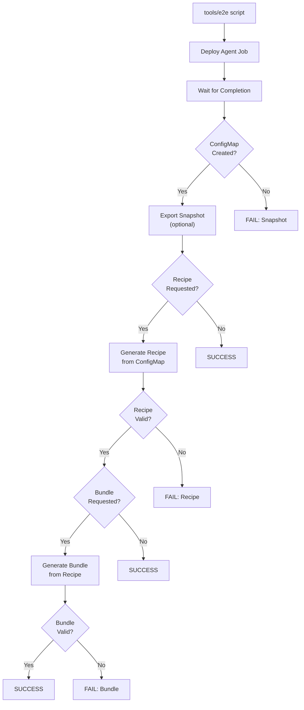

### E2E Script Features

**Command-Line Interface**:
- `-s/--snapshot PATH`: Save snapshot to file (optional)
- `-r/--recipe PATH`: Generate and save recipe (optional)
- `-b/--bundle DIR`: Generate bundle to directory (optional)
- `-h/--help`: Show usage information
- Order-independent flags (can specify in any order)

**Validation Steps**:
1. **Agent Deployment**: Apply RBAC manifests and Job
2. **Job Completion**: Wait for Job success with timeout
3. **ConfigMap Verification**: Check `eidos-snapshot` exists with data
4. **Recipe Generation**: Use ConfigMap URI input (`cm://gpu-operator/eidos-snapshot`)
5. **Bundle Generation**: Create deployment artifacts from recipe
6. **Artifact Verification**: Validate file creation and structure

**Smart Execution**:
- Uses recipe file if provided, otherwise reads from ConfigMap
- Skips steps if corresponding flags not provided
- No cleanup on failure (preserves resources for debugging)
- Comprehensive error messages with context

**Example Usage**:
```bash
# Full workflow (snapshot → recipe → bundle)
./tools/e2e -s examples/snapshots/gb200.yaml \
           -r examples/recipes/gb200-eks-ubuntu-training.yaml \
           -b examples/bundles/gb200-eks-ubuntu-training

# Just capture snapshot from agent
./tools/e2e -s snapshot.yaml

# Generate recipe and bundle (skip snapshot file)
./tools/e2e -r recipe.yaml -b ./bundles
```

### Integration with CI/CD

The e2e script is designed for integration with CI/CD pipelines:

```yaml
# Example GitHub Actions workflow
steps:
  - name: Setup Kubernetes cluster
    uses: actions/setup-kind@v1
    
  - name: Run E2E tests
    run: |
      ./tools/e2e \
        -s /tmp/snapshot.yaml \
        -r /tmp/recipe.yaml \
        -b /tmp/bundles
      
  - name: Upload artifacts
    uses: actions/upload-artifact@v4
    with:
      name: e2e-results
      path: /tmp/
```

**Benefits**:
- **Automated Validation**: Validates complete workflow in CI/CD
- **Regression Detection**: Catches breaking changes early
- **ConfigMap Testing**: Validates Kubernetes-native storage pattern
- **Agent Testing**: Validates RBAC permissions and Job execution
- **Bundle Verification**: Ensures deployment artifacts are correct

For detailed usage, see [../../CONTRIBUTING.md#end-to-end-testing](../../CONTRIBUTING.md#end-to-end-testing).

## References and Further Reading

### Official Go Documentation
- [Effective Go](https://go.dev/doc/effective_go)  
- [Go Concurrency Patterns](https://go.dev/blog/pipelines)  
- [Context Package](https://pkg.go.dev/context)  
- [Error Handling](https://go.dev/blog/error-handling-and-go)

### Distributed Systems
- [Designing Data-Intensive Applications](https://dataintensive.net/) by Martin Kleppmann  
- [Site Reliability Engineering](https://sre.google/books/) by Google  
- [Building Microservices](https://www.oreilly.com/library/view/building-microservices-2nd/9781492034018/) by Sam Newman

### Kubernetes
- [Kubernetes Patterns](https://www.oreilly.com/library/view/kubernetes-patterns/9781492050278/)  
- [Programming Kubernetes](https://www.oreilly.com/library/view/programming-kubernetes/9781492047094/)  
- [client-go Documentation](https://github.com/kubernetes/client-go/tree/master/examples)

### Observability
- [Prometheus Best Practices](https://prometheus.io/docs/practices/)  
- [OpenTelemetry Go SDK](https://pkg.go.dev/go.opentelemetry.io/otel)  
- [Structured Logging](https://pkg.go.dev/log/slog)

See individual architecture documents for detailed diagrams and component interactions.
