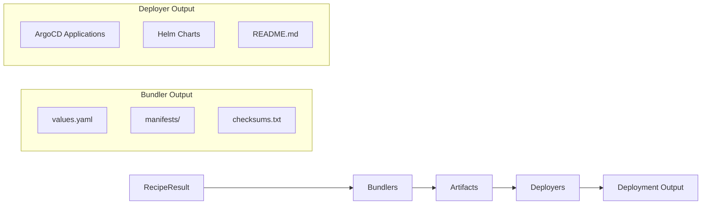

# Bundler Development Guide

Learn how to add new components to Eidos.

## Overview

The bundler system converts RecipeInput objects into deployment artifacts. Artifacts include Helm values files, Kubernetes manifests, and optional custom manifests. Deployment documentation (READMEs) is generated at the deployer level, not by individual component bundlers.

**Architecture:**

- **Declarative Component Registry**: Component configuration is defined in `pkg/recipe/data/registry.yaml`
- **No separate Go packages**: Adding a new component only requires a registry entry and values files
- **DefaultBundler**: The `pkg/bundler` package generates Helm umbrella charts from recipes
- **Recipe-driven**: Components are selected based on recipe's `componentRefs`
- **Value overrides**: CLI `--set` flag allows runtime customization via `ApplyMapOverrides()`
- **Node scheduling**: Registry defines paths for injecting node selectors and tolerations
- **Structured errors**: Uses `pkg/errors` for error codes and wrapping

## Quick Start

### Adding a New Component (Declarative Approach)

Adding a new component requires **no Go code**. Simply add an entry to the component registry:

**Step 1: Add to `pkg/recipe/data/registry.yaml`**

```yaml
components:
  # ... existing components ...

  - name: my-operator
    displayName: My Operator
    valueOverrideKeys:
      - myoperator
    helm:
      defaultRepository: https://charts.example.com
      defaultChart: example/my-operator
      defaultVersion: v1.0.0
    nodeScheduling:
      system:
        nodeSelectorPaths:
          - operator.nodeSelector
        tolerationPaths:
          - operator.tolerations
```

**Step 2: Add component values file**

Create `pkg/recipe/data/components/my-operator/values.yaml`:

```yaml
# My Operator Helm values
operator:
  replicas: 1
  image:
    repository: example/my-operator
    tag: v1.0.0
```

**Step 3: Reference in recipe**

Add the component to a recipe overlay in `pkg/recipe/data/overlays/`:

```yaml
componentRefs:
  - name: my-operator
    type: Helm
    version: v1.0.0
    source: https://charts.example.com
    valuesFile: components/my-operator/values.yaml
```

That's it! The bundler system automatically:
- Loads component configuration from the registry
- Extracts values from the recipe's valuesFile
- Applies user value overrides from CLI `--set` flags
- Applies node selectors and tolerations to configured paths
- Generates the umbrella chart with the component as a dependency

### Optional: Custom Manifests

For components that need additional Kubernetes manifests (beyond the Helm chart), add them to `pkg/recipe/data/components/<name>/manifests/`:

**Step 1: Create manifest file**

Create `pkg/recipe/data/components/gpu-operator/manifests/dcgm-exporter.yaml`:

```yaml
# DCGM Exporter ConfigMap
{{- $gpuOp := index .Values "gpu-operator" }}
{{- if and $gpuOp $gpuOp.dcgmExporter $gpuOp.dcgmExporter.config $gpuOp.dcgmExporter.config.create }}
---
apiVersion: v1
kind: ConfigMap
metadata:
  name: {{ $gpuOp.dcgmExporter.config.name | default "dcgm-exporter" }}
  namespace: {{ .Release.Namespace }}
data:
  dcgm-metrics.csv: |
    # Metrics configuration
{{- end }}
```

**Step 2: Reference in recipe**

Add the manifest to the component's `manifestFiles` in the recipe:

```yaml
componentRefs:
  - name: gpu-operator
    type: Helm
    version: v25.3.3
    manifestFiles:
      - components/gpu-operator/manifests/dcgm-exporter.yaml
```

The bundler automatically includes manifest files in the umbrella chart's `templates/` directory.

### Registry Configuration Reference

The component registry (`pkg/recipe/data/registry.yaml`) supports these fields:

**Helm Component Configuration:**

```yaml
- name: component-name              # Required: Component identifier
  displayName: Component Name       # Required: Human-readable name
  valueOverrideKeys:               # Optional: Alternative --set prefixes
    - componentname
  helm:
    defaultRepository: https://...  # Optional: Default Helm repo URL
    defaultChart: repo/chart        # Optional: Default chart name
    defaultVersion: v1.0.0          # Optional: Default chart version
  nodeScheduling:
    system:                        # For system/control-plane components
      nodeSelectorPaths:
        - operator.nodeSelector
      tolerationPaths:
        - operator.tolerations
    accelerated:                   # For GPU workload components
      nodeSelectorPaths:
        - daemonsets.nodeSelector
      tolerationPaths:
        - daemonsets.tolerations
```

**Kustomize Component Configuration:**

```yaml
- name: my-kustomize-app            # Required: Component identifier
  displayName: My Kustomize App     # Required: Human-readable name
  valueOverrideKeys:               # Optional: Alternative --set prefixes
    - mykustomize
  kustomize:
    defaultSource: https://github.com/example/my-app  # Required: Git repo or OCI reference
    defaultPath: deploy/production  # Optional: Path to kustomization
    defaultTag: v1.0.0              # Optional: Git tag, branch, or commit
```

**Note:** A component must have either `helm` OR `kustomize` configuration, not both. The system will detect the component type based on which configuration is present.

**Note:**
- Values are written directly to `values.yaml`, not via templates
- Deployment documentation (README) is generated at the deployer level (helm, argocd)
- The `pkg/component` package provides helper utilities if custom bundler logic is needed

## Best Practices

### Adding Components

- **Prefer declarative configuration**: Add entries to `registry.yaml` rather than writing Go code
- Use consistent naming: component name should match the Helm chart name (e.g., `gpu-operator`)
- Define `valueOverrideKeys` for user-friendly `--set` prefixes (e.g., `gpuoperator` allows `--set gpuoperator:key=value`)
- Configure `nodeScheduling` paths only for components that need workload placement
- Create values files under `pkg/recipe/data/components/<name>/` for reusable configurations

### Values Files

- Keep base values (`values.yaml`) minimal and widely applicable
- Create overlay values (`values-<context>.yaml`) for specific scenarios
- Document non-obvious settings with comments
- Use consistent formatting (2-space indent for YAML)

### Custom Manifests

- Only add custom manifests when the Helm chart doesn't provide needed functionality
- Use Helm template syntax (not Go templates) for manifest files
- Reference values via `{{ index .Values "component-name" }}`
- Make manifests conditional with `{{- if }}` blocks

### Testing

- Run `make test` to validate all recipe data
- Test recipe generation: `eidos recipe --service eks --accelerator gb200`
- Test bundle generation: `eidos bundle -r recipe.yaml -o ./test-bundle`
- Verify generated `values.yaml` contains expected settings

### Documentation

- Update `pkg/recipe/data/README.md` when adding new components
- Document component-specific settings in values file comments
- Add examples to `examples/` directory for common use cases

## Common Patterns

### Component Registry Structure

Components are configured in `pkg/recipe/data/registry.yaml`. Here's an example entry:

```yaml
- name: gpu-operator
  displayName: GPU Operator
  valueOverrideKeys:
    - gpuoperator
  helm:
    defaultRepository: https://helm.ngc.nvidia.com/nvidia
    defaultChart: nvidia/gpu-operator
    defaultVersion: v25.3.3
  nodeScheduling:
    system:
      nodeSelectorPaths:
        - operator.nodeSelector
        - node-feature-discovery.gc.nodeSelector
        - node-feature-discovery.master.nodeSelector
      tolerationPaths:
        - operator.tolerations
        - node-feature-discovery.gc.tolerations
        - node-feature-discovery.master.tolerations
    accelerated:
      nodeSelectorPaths:
        - daemonsets.nodeSelector
        - node-feature-discovery.worker.nodeSelector
      tolerationPaths:
        - daemonsets.tolerations
        - node-feature-discovery.worker.tolerations
```

### Node Selector and Toleration Handling

The bundle command supports `--system-node-selector`, `--system-node-toleration`, `--accelerated-node-selector`, and `--accelerated-node-toleration` flags.

**How it works:**
1. Paths are defined in `registry.yaml` under `nodeScheduling`
2. The bundler automatically applies CLI flag values to those paths
3. Values are written to the component's section in the umbrella chart's `values.yaml`

**Example CLI usage:**
```bash
eidos bundle -r recipe.yaml \
  --system-node-selector nodeGroup=system-pool \
  --accelerated-node-selector nvidia.com/gpu.present=true \
  -o ./bundles
```

### Value Overrides

Override component values at bundle generation time:

```bash
# Override GPU Operator driver version
eidos bundle -r recipe.yaml --set gpuoperator:driver.version=580.82.07 -o ./bundles

# Multiple overrides
eidos bundle -r recipe.yaml \
  --set gpuoperator:driver.version=580.82.07 \
  --set gpuoperator:gds.enabled=true \
  -o ./bundles
```

The prefix before `:` matches the component's `valueOverrideKeys` in the registry.

## Deployer Integration

After bundlers generate deployment artifacts, deployers transform them into deployment-specific formats. The deployer framework is separate from bundlers but works with their output.

### How Bundlers and Deployers Work Together



### Deployment Order

Deployers respect the `deploymentOrder` field from the recipe to ensure components are deployed in the correct sequence:

| Deployer | Ordering Mechanism |
|----------|-------------------|
| `helm` | Components listed in order in README |
| `argocd` | `sync-wave` annotations (0, 1, 2...) |

**Example Recipe with Deployment Order**:
```yaml
componentRefs:
  - name: cert-manager
    version: v1.17.2
  - name: gpu-operator
    version: v25.3.3
  - name: network-operator
    version: v25.4.0
deploymentOrder:
  - cert-manager
  - gpu-operator
  - network-operator
```

### Bundler Output for Deployers

When the `--deployer` flag is set, bundlers generate standard artifacts that deployers then transform:

**For Helm** (`--deployer helm`, default):
- Generates Helm umbrella chart with Chart.yaml and values.yaml
- Creates combined values with all component configurations
- Includes dependency references to component charts

**For ArgoCD** (`--deployer argocd`):
- Bundler generates `values.yaml` and `manifests/`
- Deployer creates `<component>/argocd/application.yaml` with sync-wave annotations
- Deployer creates `app-of-apps.yaml` at bundle root
- Applications use multi-source to reference values.yaml and manifests from GitOps repo

### Using Deployers with Bundlers

The deployer is specified at bundle generation time:

```bash
# Default: Helm umbrella chart
eidos bundle -r recipe.yaml -o ./bundles

# Generate bundles with ArgoCD deployer (use --repo to set Git repository URL)
eidos bundle -r recipe.yaml -o ./bundles --deployer argocd \
  --repo https://github.com/my-org/my-gitops-repo.git
```

See [CLI Architecture](cli.md#deployer-framework-gitops-integration) for detailed deployer documentation.

## See Also

- [Architecture Overview](README.md) - Complete bundler framework architecture
- [CLI Architecture](cli.md) - Deployer framework and GitOps integration
- [CLI Reference](../user-guide/cli-reference.md) - Bundle generation commands
- [API Reference](../integration/api-reference.md) - Programmatic access (recipe generation only)
- [Component Registry](../../pkg/recipe/data/registry.yaml) - Declarative component configuration
- [Recipe Data README](../../pkg/recipe/data/README.md) - Recipe and component data overview
