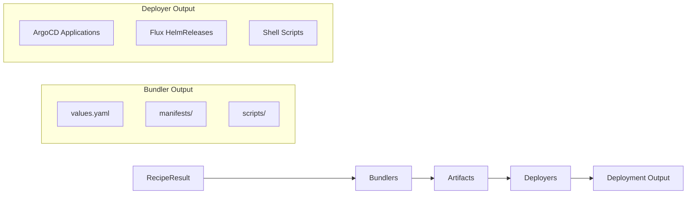

# Bundler Development Guide

Learn how to create new bundlers for Cloud Native Stack.

## Overview

Bundlers convert RecipeInput objects into deployment artifacts. Artifacts include Helm values files, Kubernetes manifests, and README documentation.

**Framework features:**

- **Generic bundler framework**: `ComponentConfig` struct + `MakeBundle()` function handles all common logic
- **Factory registration**: Bundlers register factory functions via `registry.MustRegister()` in `init()`
- **RecipeInput interface**: Single `Make()` method handles both Recipe and RecipeResult via interface
- **BaseBundler**: Helper struct from `pkg/component/internal` providing file operations
- **Config injection**: Bundlers receive `*config.Config` with value overrides, node selectors, etc.
- **Parallel execution**: Multiple bundlers run concurrently via `goroutines` with `errgroup` context cancellation
- **Template system**: Bundlers embed templates individually using `go:embed` directive
- **Value overrides**: CLI `--set` flag allows runtime customization via `ApplyMapOverrides()`
- **Structured errors**: Uses `pkg/errors` for error codes and wrapping

## Quick Start

### Minimal Bundler Implementation

The bundler framework uses a **declarative configuration pattern**. Define a `ComponentConfig` and delegate to `MakeBundle()`:

```go
// pkg/component/mybundler/bundler.go
package mybundler

import (
    "context"

    "github.com/NVIDIA/cloud-native-stack/pkg/bundler/config"
    "github.com/NVIDIA/cloud-native-stack/pkg/bundler/result"
    "github.com/NVIDIA/cloud-native-stack/pkg/bundler/types"
    "github.com/NVIDIA/cloud-native-stack/pkg/component/internal"
    "github.com/NVIDIA/cloud-native-stack/pkg/recipe"
)

const (
    Name = "my-bundler"
)

// componentConfig defines all component-specific settings.
var componentConfig = internal.ComponentConfig{
    Name:                  Name,
    DisplayName:           "My Bundler",
    ValueOverrideKeys:     []string{"mybundler"},
    DefaultHelmRepository: "https://charts.example.com",
    DefaultHelmChart:      "example/my-bundler",
    TemplateGetter:        GetTemplate,
}

// Bundler generates deployment bundles from RecipeInput.
type Bundler struct {
    *internal.BaseBundler
}

// NewBundler creates a new bundler instance.
func NewBundler(cfg *config.Config) *Bundler {
    return &Bundler{
        BaseBundler: internal.NewBaseBundler(cfg, types.BundleTypeMyBundler),
    }
}

// Make generates the bundle by delegating to the generic MakeBundle function.
func (b *Bundler) Make(ctx context.Context, input recipe.RecipeInput, dir string) (*result.Result, error) {
    return internal.MakeBundle(ctx, b.BaseBundler, input, dir, componentConfig)
}
```

That's it! The `MakeBundle()` function handles:
- Extracting component values from recipe input
- Applying user value overrides from CLI `--set` flags
- Applying node selectors and tolerations to configured Helm paths
- Creating directory structure
- Writing values.yaml with proper headers
- Generating README from templates
- Computing checksums
    valuesYAML, err := common.MarshalYAMLWithHeader(values, header)
    if err != nil {
        return b.Result, errors.Wrap(errors.ErrCodeInternal,
            "failed to serialize values to YAML", err)
    }
    
    // 8. Write values.yaml
    valuesPath := filepath.Join(dirs.Root, "values.yaml")
    if err := b.WriteFile(valuesPath, valuesYAML, 0644); err != nil {
        return b.Result, errors.Wrap(errors.ErrCodeInternal,
            "failed to write values file", err)
    }
    
    // 9. Generate bundle metadata for README
    metadata := GenerateBundleMetadata(configMap)
    
    // 10. Generate README
    if b.Config.IncludeReadme() {
        // The "Script" key is preserved for template compatibility
        readmeData := map[string]interface{}{
            "Values": values,
            "Script": metadata, // "Script" key preserved for template compatibility
        }
        readmePath := filepath.Join(dirs.Root, "README.md")
        if err := b.GenerateFileFromTemplate(ctx, GetTemplate, "README.md",
            readmePath, readmeData, 0644); err != nil {
            return b.Result, err
        }
    }
    
    // 11. Generate checksums
    if b.Config.IncludeChecksums() {
        if err := b.GenerateChecksums(ctx, dirs.Root); err != nil {
            return b.Result, errors.Wrap(errors.ErrCodeInternal,
                "failed to generate checksums", err)
        }
    }
    
    // 12. Finalize bundle generation
    b.Finalize(start)
    
    return b.Result, nil
}
```

### Registration (register.go)

Bundlers register themselves via `init()` functions using a factory pattern:

```go
// pkg/component/mybundler/register.go
package mybundler

import (
    "github.com/NVIDIA/cloud-native-stack/pkg/bundler/config"
    "github.com/NVIDIA/cloud-native-stack/pkg/bundler/registry"
    "github.com/NVIDIA/cloud-native-stack/pkg/bundler/types"
)

func init() {
    // Register bundler factory in global registry
    registry.MustRegister(types.BundleTypeMyBundler, func(cfg *config.Config) registry.Bundler {
        return NewBundler(cfg)
    })
}
```

### Custom Metadata (Optional)

For components that need additional metadata beyond the defaults, provide a `MetadataFunc`:

```go
// componentConfig with custom metadata function
var componentConfig = internal.ComponentConfig{
    Name:                  Name,
    DisplayName:           "Cert Manager",
    ValueOverrideKeys:     []string{"certmanager"},
    DefaultHelmRepository: "https://charts.jetstack.io",
    DefaultHelmChart:      "jetstack/cert-manager",
    TemplateGetter:        GetTemplate,
    // Custom metadata adds InstallCRDs field
    MetadataFunc: func(configMap map[string]string, values map[string]interface{}) interface{} {
        metadata := internal.GenerateDefaultBundleMetadata(configMap)
        return &BundleMetadata{
            BundleMetadata: *metadata,
            InstallCRDs:    getBoolValue(values, "installCRDs", true),
        }
    },
}

// BundleMetadata extends the default with component-specific fields.
type BundleMetadata struct {
    internal.BundleMetadata
    InstallCRDs bool
}
```

### Custom Manifest Generation (Optional)

For components that generate additional Kubernetes manifests, provide a `CustomManifestFunc`:

```go
// componentConfig with custom manifest generation
var componentConfig = internal.ComponentConfig{
    Name:                  Name,
    DisplayName:           "GPU Operator",
    ValueOverrideKeys:     []string{"gpuoperator"},
    DefaultHelmRepository: "https://helm.ngc.nvidia.com/nvidia",
    DefaultHelmChart:      "nvidia/gpu-operator",
    TemplateGetter:        GetTemplate,
    // Custom manifest function generates DCGM exporter and kernel module params
    CustomManifestFunc: func(ctx context.Context, b *internal.BaseBundler, 
        input recipe.RecipeInput, dirs *internal.BundleDirs, 
        configMap map[string]string, values map[string]interface{}) error {
        
        manifestsDir := filepath.Join(dirs.Root, "manifests")
        if err := os.MkdirAll(manifestsDir, 0755); err != nil {
            return err
        }
        
        // Generate DCGM exporter ConfigMap
        if err := generateDCGMExporterManifest(ctx, b, manifestsDir, configMap, values); err != nil {
            return err
        }
        
        return nil
    },
}
```

### Templates (templates.go + templates/)

Templates are embedded using `go:embed` and accessed via a `GetTemplate` function:

```go
// pkg/component/mybundler/templates.go
package mybundler

import (
    _ "embed"
)

//go:embed templates/README.md.tmpl
var readmeTemplate string

// GetTemplate returns the named template content.
func GetTemplate(name string) (string, bool) {
    templates := map[string]string{
        "README.md": readmeTemplate,
    }
    tmpl, ok := templates[name]
    return tmpl, ok
}
```

**Template files** in `templates/` directory:

```markdown
# templates/README.md.tmpl - Receives combined map with Values + Script (metadata)
# My Bundler Deployment

Bundler Version: {{ .Script.Version }}
Recipe Version: {{ .Script.RecipeVersion }}

## Prerequisites

- Kubernetes cluster
- Helm 3.x
- kubectl configured

## Installation

\```bash
helm repo add myrepo {{ .Script.HelmRepository }}
helm install my-bundler myrepo/{{ .Script.HelmChart }} \
  --namespace {{ .Script.Namespace }} \
  --create-namespace \
  -f values.yaml
\```

## Verification

\```bash
kubectl get pods -n {{ .Script.Namespace }}
\```
```

**Note:** Values are written directly to `values.yaml` using `internal.MarshalYAMLWithHeader()`, not via templates. Templates are used for README documentation.

## Best Practices

### Implementation

- ✅ Use `ComponentConfig` struct for declarative bundler definition
- ✅ Delegate to `internal.MakeBundle()` for all common logic
- ✅ Use `Name` constant instead of hardcoded component names
- ✅ Use `ValueOverrideKeys` to specify which CLI `--set` prefixes apply
- ✅ Use `*NodeSelectorPaths` and `*TolerationPaths` for node scheduling
- ✅ Only add `MetadataFunc` if you need custom metadata fields
- ✅ Only add `CustomManifestFunc` if you need additional K8s manifests
- ✅ Use `go:embed` for template portability
- ✅ Use structured errors from `pkg/errors`

### Testing

- ✅ Use table-driven tests with `*recipe.RecipeResult`
- ✅ Test with `t.TempDir()` for isolation
- ✅ Test both valid and missing component reference cases
- ✅ Verify file existence with `os.Stat()`
- ✅ Verify file content with `os.ReadFile()` + `strings.Contains()`
- ✅ Test `GetTemplate()` returns expected templates
- ✅ Test `NewBundler()` with nil and valid configs

### Templates

- ✅ Use `GetTemplate(name)` function pattern (returns `(string, bool)`)
- ✅ For README, templates receive `{"Values": values, "Script": metadata}`
- ✅ Access BundleMetadata fields directly: `{{ .Script.Namespace }}`, `{{ .Script.Version }}`
- ✅ Access values in README: `{{ index .Values "key" }}`
- ✅ Handle missing values gracefully with `{{- if }}`
- ✅ Validate template rendering in tests

### Documentation

- ✅ Add package doc.go with overview
- ✅ Document exported types and functions
- ✅ Include examples in README.md template
- ✅ Explain prerequisites and deployment steps

## Common Patterns

### Using ComponentConfig

The `ComponentConfig` struct defines all component-specific settings declaratively:

```go
var componentConfig = internal.ComponentConfig{
    // Required fields
    Name:                  "my-component",           // Component name (matches recipe)
    DisplayName:           "My Component",           // Human-readable name for headers
    ValueOverrideKeys:     []string{"mycomponent"},  // CLI --set prefix keys
    DefaultHelmRepository: "https://charts.example.com",
    DefaultHelmChart:      "example/my-component",
    TemplateGetter:        GetTemplate,              // Template access function
    
    // Optional: Node scheduling paths (for system/accelerated node flags)
    SystemNodeSelectorPaths:      []string{"operator.nodeSelector"},
    SystemTolerationPaths:        []string{"operator.tolerations"},
    AcceleratedNodeSelectorPaths: []string{"daemonsets.nodeSelector"},
    AcceleratedTolerationPaths:   []string{"daemonsets.tolerations"},
    
    // Optional: Custom extensions
    MetadataFunc:       nil,  // Custom metadata for README templates
    CustomManifestFunc: nil,  // Additional K8s manifest generation
}
```

### Node Selector and Toleration Handling

The bundle command supports `--system-node-selector`, `--system-node-toleration`, `--accelerated-node-selector`, and `--accelerated-node-toleration` flags.

**How it works with ComponentConfig**:
1. Define paths in `ComponentConfig.*NodeSelectorPaths` and `*TolerationPaths`
2. `MakeBundle()` automatically applies CLI values to those paths
3. Templates render the values normally

**Bundler-specific paths** (defined in ComponentConfig):

**GPU Operator**:
- `SystemNodeSelectorPaths`: `["operator.nodeSelector"]`
- `SystemTolerationPaths`: `["operator.tolerations"]`
- `AcceleratedNodeSelectorPaths`: `["daemonsets.nodeSelector"]`
- `AcceleratedTolerationPaths`: `["daemonsets.tolerations"]`

**Network Operator**:
- `SystemNodeSelectorPaths`: `["operator.nodeSelector"]`
- `AcceleratedNodeSelectorPaths`: `["daemonsets.nodeSelector"]`

**Cert-Manager**:
- `SystemNodeSelectorPaths`: `["controller.nodeSelector"]`
- `SystemTolerationPaths`: `["controller.tolerations"]`

### Error Handling

Errors are handled automatically by `MakeBundle()`. For custom functions, use structured errors:

```go
// In CustomManifestFunc or MetadataFunc
if err != nil {
    return errors.Wrap(errors.ErrCodeInternal,
        "failed to generate manifest", err)
}
```

## Deployer Integration

After bundlers generate deployment artifacts, deployers transform them into deployment-specific formats. The deployer framework is separate from bundlers but works with their output.

### How Bundlers and Deployers Work Together



### Deployment Order

Deployers respect the `deploymentOrder` field from the recipe to ensure components are deployed in the correct sequence:

| Deployer | Ordering Mechanism |
|----------|-------------------|
| `script` | Components listed in order in README |
| `argocd` | `sync-wave` annotations (0, 1, 2...) |
| `flux` | `dependsOn` fields creating dependency chain |

**Example Recipe with Deployment Order**:
```yaml
componentRefs:
  - name: cert-manager
    version: v1.17.2
  - name: gpu-operator
    version: v25.3.3
  - name: network-operator
    version: v25.4.0
deploymentOrder:
  - cert-manager
  - gpu-operator
  - network-operator
```

### Bundler Output for Deployers

When the `--deployer` flag is set, bundlers generate standard artifacts that deployers then transform:

**For Helm** (`--deployer helm`, default):
- Generates Helm umbrella chart with Chart.yaml and values.yaml
- Creates combined values with all component configurations
- Includes dependency references to component charts

**For ArgoCD** (`--deployer argocd`):
- Bundler generates `values.yaml` and `manifests/`
- Deployer creates `<component>/argocd/application.yaml` with sync-wave annotations
- Deployer creates `app-of-apps.yaml` at bundle root
- Applications use multi-source to reference values.yaml and manifests from GitOps repo

### Using Deployers with Bundlers

The deployer is specified at bundle generation time:

```bash
# Default: Helm umbrella chart
cnsctl bundle -r recipe.yaml -o ./bundles

# Generate bundles with ArgoCD deployer (use --repo to set Git repository URL)
cnsctl bundle -r recipe.yaml -o ./bundles --deployer argocd \
  --repo https://github.com/my-org/my-gitops-repo.git
```

See [CLI Architecture](cli.md#deployer-framework-gitops-integration) for detailed deployer documentation.

## See Also

- [Architecture Overview](README.md) - Complete bundler framework architecture
- [CLI Architecture](cli.md) - Deployer framework and GitOps integration
- [CLI Reference](../user-guide/cli-reference.md) - Bundle generation commands
- [API Reference](../integration/api-reference.md) - Programmatic access (recipe generation only)
- [GPU Operator implementation](../../pkg/component/gpuoperator) - Reference example
